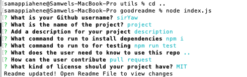

Create a command-line application that dynamically generates a README.md from a user's input. The application will be invoked with the following command:

node index.js

The user will be prompted for their GitHub username, which will be used to make a call to the GitHub API to retrieve their email and profile image. They will then be prompted with questions about their project.

The README will be populated with the following:

At least one badge
Project title
Description
Table of Contents
Installation
Usage
License
Contributing
Tests
Questions
User GitHub profile picture
User GitHub email

# project



[](https://github.com/sirYaw/project)

## Description

Insert project description


## Table of Contents 

* [Installation](#installation)
* [Usage](#usage)
* [Tests](#tests)
* [License](#license)
* [Contributing](#contributing)

* [Questions](#questions)

## Installation

Run to install the necessary dependecies: 

```
npm i
```

## Tests

Run command for test:

```
undefined
```

## Usage

Enter usage information

## License
This project is licensed under the MIT license.
  
## Contributing

pull request

## Questions


If you have any questions about the repo, open an issue or contact [sirYaw](https://api.github.com/users/siryaw) directly at null.
